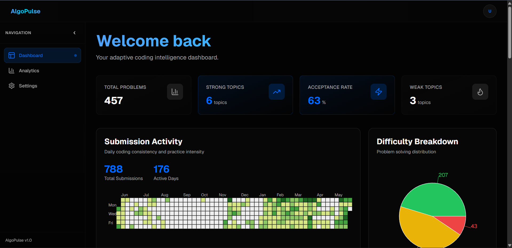
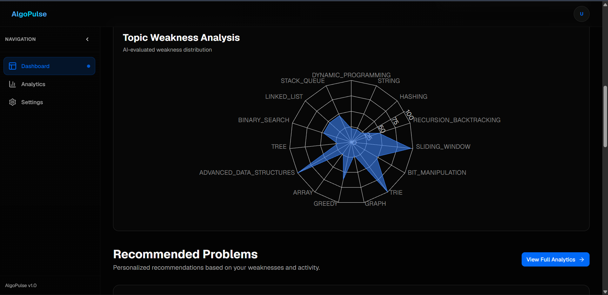
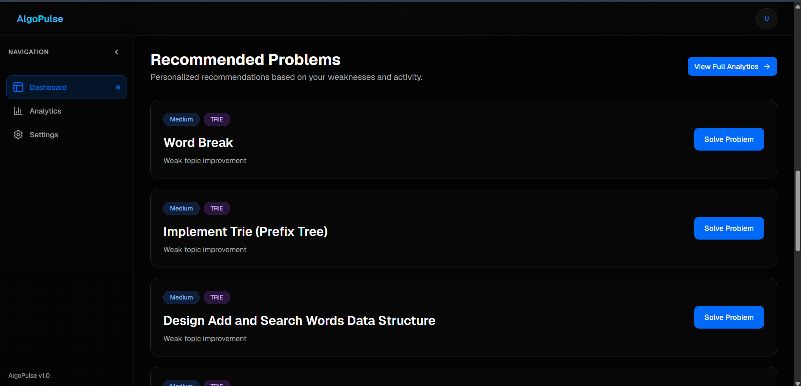
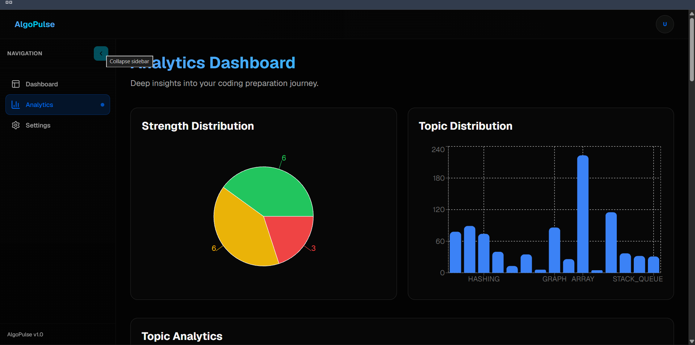
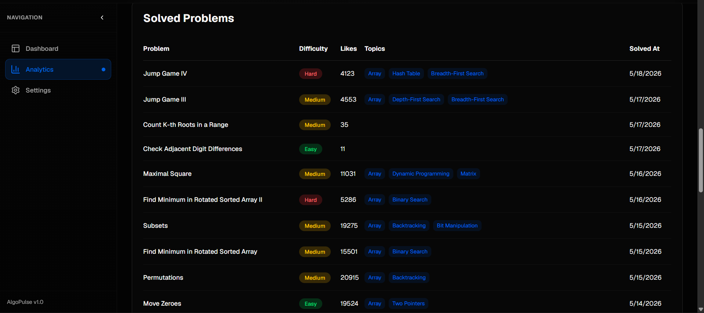
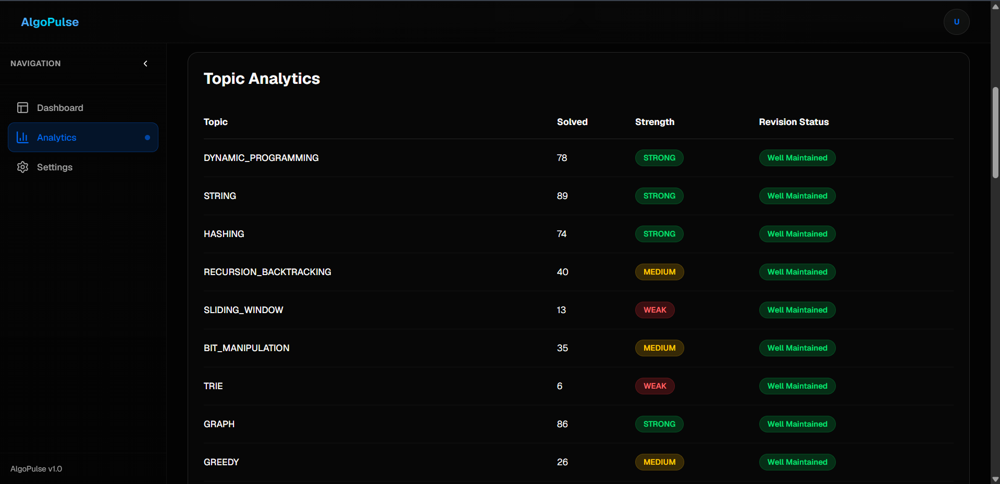
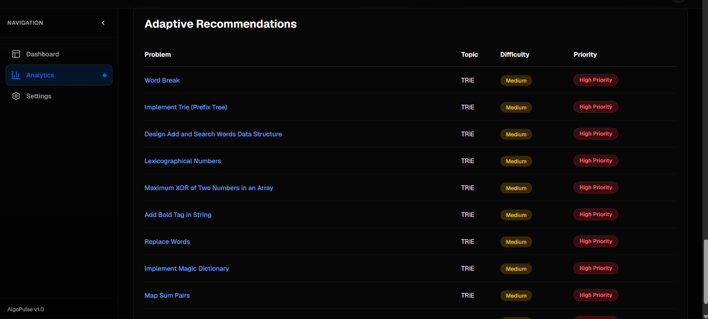

# Algo-Pulse — LeetCode Analytics & Preparation Platform

> A full-stack platform that connects to your LeetCode profile, analyses your solving patterns, identifies weak topics, and serves personalised problem recommendations.

---

## 🌐 Live Demo

| Service | URL |
|---|---|
|  Frontend | [algo-pulse-frontend.vercel.app](https://algo-pulse-frontend.vercel.app/) |
|  Backend API | [algopulse-backend-3knx.onrender.com](https://algopulse-backend-3knx.onrender.com) |
|  Database | Neon DB (Serverless PostgreSQL) |

---

##  Screenshots

### Dashboard Overview



### Topic Analytics


### Weakness & Recommendations




##  Features

- **JWT Authentication** — Secure register/login with stateless JWT tokens
- **LeetCode Integration** — Fetches solved problems, skill tags, contest stats, and submission history via the LeetCode GraphQL API
- **Topic Analytics** — Categorises all solved problems into core DSA topics (Arrays, Trees, Graphs, DP, etc.) and computes strength levels (Strong / Medium / Weak)
- **Decay System** — Automatically reduces topic strength over time if not practised, keeping your profile fresh and realistic
- **Weakness Score Engine** — Scores each topic based on accuracy, speed, recency, and volume to surface genuine weak points
- **Smart Recommendations** — Suggests problems tailored to your current weakest topics
- **Difficulty Analytics** — Breaks down your Easy / Medium / Hard distribution and acceptance rate
- **Activity Calendar** — Returns a submission heatmap for the past year
- **Daily Scheduler** — Background job syncs all users' LeetCode data every 24 hours automatically
- **Caffeine Caching** — In-memory cache (45-minute TTL) reduces redundant LeetCode API calls
- **Swagger / OpenAPI UI** — Fully documented REST API browsable at `/swagger-ui.html`
- **Docker-ready** — One-command setup with Docker Compose for local development

---

##  Architecture

```
React Frontend (Vercel)
       │
       ▼
Spring Boot REST API (Render)
  ├── Auth Module        → JWT register / login / profile
  ├── Analytics Module   → Topic strength, decay, weakness, calendar, recommendations
  ├── LeetCode Module    → GraphQL client to leetcode.com
  └── Scheduler          → Daily background sync (every 24 h)
       │
  ┌────┴────────────────────┐
  │                         │
Neon DB                  Redis
(Serverless PostgreSQL)  (Cache layer)
```

---

##  Tech Stack

| Layer | Technology |
|---|---|
| Language | Java 21 |
| Framework | Spring Boot 3.5 |
| Security | Spring Security + JWT |
| ORM | Spring Data JPA / Hibernate |
| Database | Neon DB (Serverless PostgreSQL) |
| Cache | Redis + Caffeine (in-memory) |
| API Docs | SpringDoc OpenAPI (Swagger UI) |
| Build | Maven (Maven Wrapper) |
| Backend Hosting | Render |
| Frontend Hosting | Vercel |
| External API | LeetCode GraphQL API |

---

##  Project Structure

```
src/main/java/com/algopulse/
├── PrepOsApplication.java       # Entry point
├── analytics/
│   ├── AnalyticsController.java    # REST endpoints for analytics
│   ├── AnalyticsService.java       # Core business logic
│   ├── AnalyticsScheduler.java     # Daily sync scheduler
│   ├── entity/                     # SolvedProblem, TopicWeaknessScore, UserFeatureSnapshot
│   ├── repository/                 # JPA repositories
│   ├── dto/                        # Response DTOs (dashboard, calendar, difficulty, etc.)
│   └── util/LeetcodeTagMapper.java # Maps LeetCode tags → core DSA topics
├── auth/
│   ├── controller/AuthController.java
│   ├── service/AuthServiceImpl.java
│   ├── security/jwt/               # JwtService, JwtAuthenticationFilter
│   └── entity/User.java
├── integration/leetcode/
│   ├── client/LeetcodeClient.java  # GraphQL API calls
│   ├── service/LeetcodeService.java
│   └── dto/                        # LeetCode response models
└── common/
    ├── config/                     # CacheConfig, RestTemplateConfig
    ├── constants/AnalyticsConstants.java
    ├── exception/GlobalExceptionHandler.java
    └── response/ApiResponse.java
```

---

##  Getting Started (Local Development)

### Prerequisites

- Java 21+
- Maven 3.9+ (or use the included `./mvnw`)
- Docker & Docker Compose

### 1. Clone the repository

```bash
git clone https://github.com/Vicky-8223/Algo-pulse-backend.git
cd Prepos
```

### 2. Start infrastructure with Docker Compose

```bash
docker-compose up -d
```

This starts Redis (port 6379). The database is hosted on Neon DB — update the connection URL in your `.env`.

### 3. Set environment variables

Create a `.env` file or export the following:

```env
SPRING_DATASOURCE_URL=<your-neon-db-jdbc-url>
SPRING_DATASOURCE_USERNAME=<neon-db-username>
SPRING_DATASOURCE_PASSWORD=<neon-db-password>
JWT_SECRET=your_super_secret_key_here
```

### 4. Run the application

```bash
./mvnw spring-boot:run
```

The API is available at `http://localhost:8080`.  
Swagger UI: `http://localhost:8080/swagger-ui.html`

---

## 📡 API Endpoints

Base URL (Production): `https://algopulse-backend-3knx.onrender.com`

### Auth — `/api/auth`

| Method | Endpoint | Description |
|---|---|---|
| POST | `/register` | Register a new user |
| POST | `/login` | Login and receive JWT + auto-sync LeetCode data |
| PUT | `/leetcode` | Update linked LeetCode username |
| GET | `/me` | Get current user profile |

### Analytics — `/api/analytics` _(requires JWT)_

| Method | Endpoint | Description |
|---|---|---|
| POST | `/sync/{username}` | Manually trigger LeetCode data sync |
| GET | `/me` | Topic-wise analytics with strength levels |
| GET | `/summary` | Overall dashboard summary (total solved, strong/weak topics) |
| GET | `/calendar` | Submission activity calendar |
| GET | `/difficulty` | Easy / Medium / Hard breakdown |
| GET | `/recommendations` | Personalised problem recommendations based on weak topics |
| GET | `/weakness` | Detailed weakness scores per topic |
| GET | `/solved-problems` | List of all synced solved problems |

### LeetCode — `/api/leetcode`

| Method | Endpoint | Description |
|---|---|---|
| GET | `/{username}` | Fetch raw LeetCode profile for any username |

---

##  Authentication

All analytics endpoints are protected. Include the JWT token in the `Authorization` header:

```
Authorization: Bearer <your_jwt_token>
```

---

##  Analytics Engine — How It Works

1. **Sync** — On login (and daily via scheduler), solved problems and skill tags are fetched from LeetCode.
2. **Topic Mapping** — LeetCode tags are mapped to ~15 core DSA topics (Arrays, Graphs, DP, Trees, etc.).
3. **Strength Calculation**
   - `STRONG` — 50+ problems solved in topic
   - `MEDIUM` — 25–49 problems
   - `WEAK` — fewer than 25 problems
4. **Decay** — If a topic hasn't been practised, a decay counter decreases daily, lowering the effective score to reflect skill fade.
5. **Feature Snapshot** — A snapshot of metrics (volume, recency, accuracy) is stored per user per topic.
6. **Weakness Score** — A composite score is computed from the snapshot to rank topics by how much attention they need.
7. **Recommendations** — Problems tagged with the weakest topics are surfaced as recommendations.

---

##  Database Schema (Key Entities)

| Entity | Description |
|---|---|
| `User` | Auth user with linked LeetCode username |
| `UserTopicProgress` | Per-topic solved count, strength, decay counter |
| `SolvedProblem` | Each synced problem with difficulty, tags, timestamp |
| `UserFeatureSnapshot` | Numeric feature vector for weakness scoring |
| `TopicWeaknessScore` | Final computed weakness rank per topic |

---

##  Author

**Vicky** · [GitHub @Vicky-8223](https://github.com/Vicky-8223)

---

##  License

This project is for personal and portfolio use. Contact the author for other uses.
